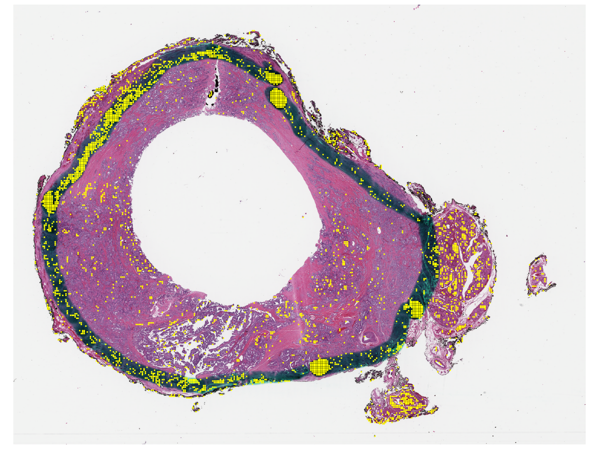

# Artifacts Detection

Work done during my master's thesis on artifacts detection in histopathological slides (TCGA and GTEx). Implementation of a kernel density estimation on a latent space built with self-supervised contrastive learning to automate artifacts detection and classification.
